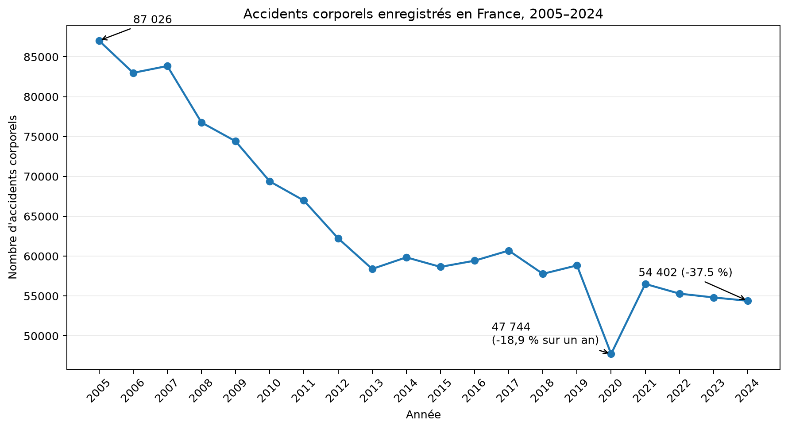
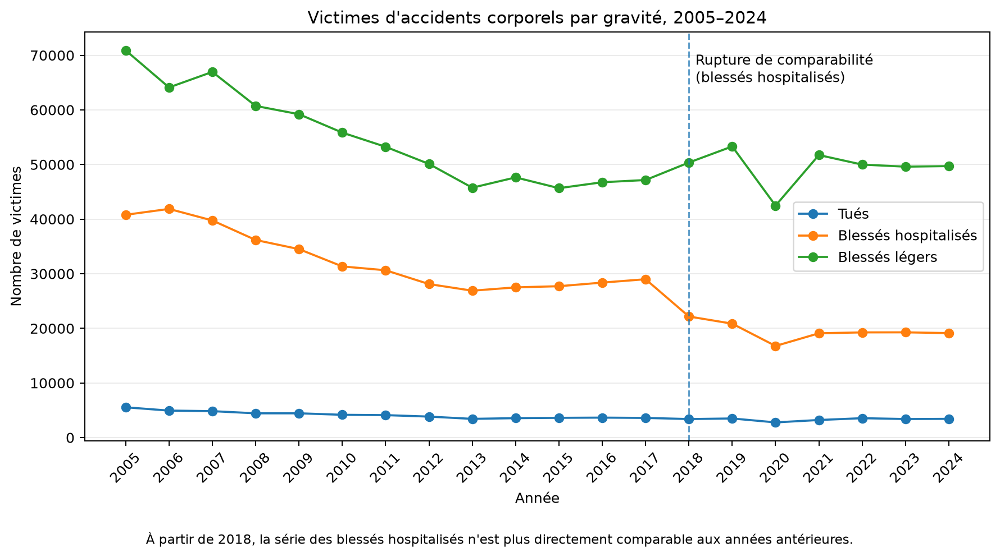
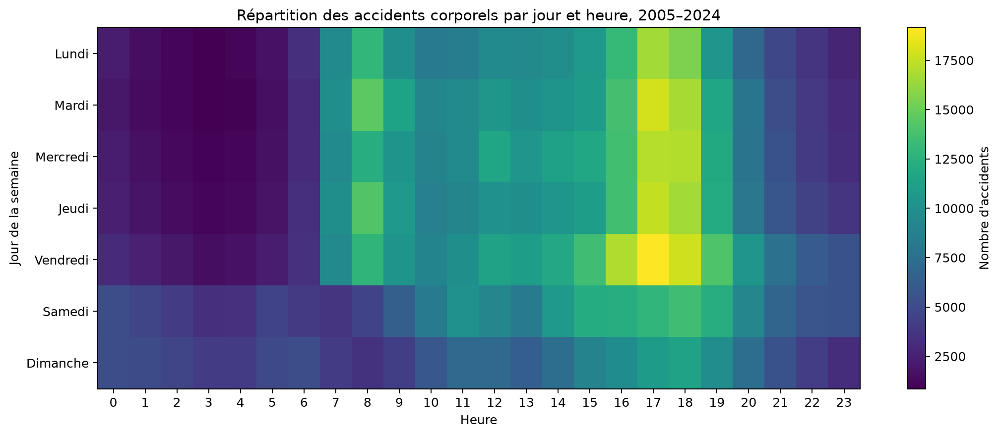
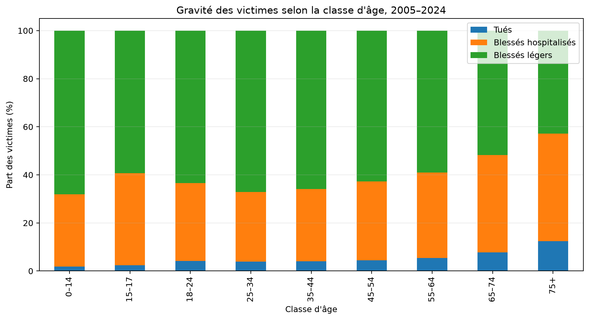

# Analyse des accidents corporels en France — BAAC 2005–2024

Cette analyse exploite les données BAAC (*Bulletins d’analyse des accidents corporels*) publiées sur data.gouv.fr pour étudier vingt années d’accidents corporels de la circulation en France, de 2005 à 2024.

L’objectif est double :

- produire quelques résultats synthétiques et lisibles ;
- documenter un pipeline reproductible allant du téléchargement des données brutes jusqu’aux tableaux agrégés et aux figures.

## Résultats

### 1. Évolution du nombre d’accidents corporels



Le nombre annuel d’accidents corporels enregistrés dans le BAAC passe de **87 026 en 2005 à 54 402 en 2024**, soit une baisse de **37,5 %** sur la période.

L’année 2020 constitue une rupture exceptionnelle avec **47 744 accidents**, soit une baisse de **18,9 %** par rapport à 2019. Le nombre d’accidents remonte ensuite en 2021, sans retrouver son niveau antérieur.

Données agrégées :

[`tables/accidents_par_annee.csv`](tables/accidents_par_annee.csv)

---

### 2. Évolution des victimes selon la gravité



Sur l’ensemble de la période, les trois catégories de victimes diminuent globalement :

- **5 543 tués en 2005 contre 3 432 en 2024** ;
- **70 891 blessés légers en 2005 contre 49 709 en 2024** ;
- la série des blessés hospitalisés présente une rupture de comparabilité à partir de 2018.

Cette rupture est explicitement signalée dans le graphique afin de ne pas interpréter directement l’évolution des blessés hospitalisés comme une série parfaitement homogène sur vingt ans.

Quelques valeurs de gravité non renseignées (`grav = -1`) apparaissent entre 2021 et 2023 : 60 cas en 2021, 241 en 2022 et 118 en 2023. Elles sont conservées dans les données agrégées mais ne sont pas intégrées aux trois séries de victimes représentées.

Données agrégées :

[`tables/victimes_par_gravite.csv`](tables/victimes_par_gravite.csv)

---

### 3. Répartition des accidents par jour et heure



La répartition temporelle des **1 286 097 accidents** enregistrés entre 2005 et 2024 fait apparaître un maximum net en fin d’après-midi, autour de **17 h–18 h**, particulièrement les jours ouvrés.

Le profil du week-end est plus étalé au cours de la journée.

Pour reconstruire correctement les dates sur l’ensemble des millésimes, l’année utilisée est celle du fichier BAAC plutôt que la colonne historique `an`, dont la représentation varie selon les années.

Après cette normalisation, les **1 286 097 observations disposent toutes d’un jour de semaine et d’une heure exploitables**.

Données agrégées :

[`tables/accidents_jour_heure.csv`](tables/accidents_jour_heure.csv)

---

### 4. Gravité des victimes selon l’âge



La gravité observée parmi les victimes augmente nettement avec l’âge.

La part des personnes tuées parmi les victimes passe notamment de :

- **1,82 % chez les 0–14 ans** ;
- à **12,41 % chez les 75 ans et plus**.

La proportion de blessés hospitalisés augmente également avec l’âge :

- **30,02 % chez les 0–14 ans** ;
- **44,72 % chez les 75 ans et plus**.

Chez les 75 ans et plus, environ **57 % des victimes sont tuées ou hospitalisées**.

Ces résultats décrivent la gravité **parmi les victimes enregistrées dans le BAAC**. Ils ne constituent pas une mesure du risque d’accident selon l’âge, qui nécessiterait notamment de connaître l’exposition à la mobilité de chaque classe d’âge.

Données agrégées :

[`tables/victimes_par_classe_age.csv`](tables/victimes_par_classe_age.csv)

## Données sources

Les données proviennent du jeu publié sur data.gouv.fr :

**Bases de données annuelles des accidents corporels de la circulation routière — Années de 2005 à 2024**

Chaque millésime comprend quatre tables principales :

- `Caract` : caractéristiques de l’accident ;
- `Lieux` : caractéristiques des lieux ;
- `Vehicules` : véhicules impliqués ;
- `Usagers` : personnes impliquées.

L’analyse porte sur les **80 fichiers annuels canoniques**, soit :

```text
20 années × 4 tables = 80 fichiers
```

Les autres ressources associées au jeu, notamment les fichiers de véhicules immatriculés et certaines anciennes bases agrégées, ne sont pas utilisées dans ces analyses.

## Pipeline

Le traitement suit les étapes suivantes :

```text
data.gouv.fr
    ↓
sélection des ressources BAAC
    ↓
téléchargement
    ↓
classement par millésime
    ↓
audit du schéma
    ↓
normalisation des particularités historiques
    ↓
agrégation
    ↓
tables CSV
    ↓
figures
```

Les principales commandes sont :

```bash
python datasets/baac/download_baac.py
python datasets/baac/schema_history.py datasets/baac

python datasets/baac/analyse_accidents.py
python datasets/baac/analyse_gravite.py
python datasets/baac/analyse_temporelle.py
python datasets/baac/analyse_age.py
```

## Évolution et qualité du schéma

L’inventaire automatique des 80 fichiers met en évidence plusieurs évolutions du BAAC.

Parmi les principales :

- disparition de `gps` et `env1` après 2018 ;
- apparition de `vma`, `id_vehicule`, `motor` et des champs `secu1`, `secu2`, `secu3` à partir de 2019 ;
- apparition de `id_usager` à partir de 2021 ;
- anomalie de nommage en 2022 : `Accident_Id` remplace temporairement `Num_Acc` dans la table des caractéristiques ;
- variations historiques d’encodage, de séparateur CSV et de représentation de certaines variables.

Ces différences sont détectées explicitement plutôt que masquées lors de l’import.

Le fichier d’inventaire est produit par :

```bash
python datasets/baac/schema_history.py datasets/baac
```

et enregistré dans :

```text
datasets/baac/schema_history.csv
```

## Précautions d’interprétation

Les séries BAAC ne doivent pas toutes être interprétées comme parfaitement homogènes sur vingt ans.

En particulier :

- les pratiques de saisie et certaines nomenclatures ont évolué ;
- la série des blessés hospitalisés présente une rupture de comparabilité à partir de 2018 ;
- certaines variables ont été ajoutées, supprimées ou renommées ;
- les données décrivent les accidents corporels enregistrés et non directement l’exposition au risque routier ;
- les analyses par âge portent sur la gravité parmi les victimes, et non sur un taux de risque rapporté à la population ou au volume de déplacements.

Ces limites sont conservées dans l’analyse plutôt que corrigées implicitement.

## Reproductibilité

Le projet est conçu pour permettre de régénérer les résultats à partir des données sources avec Python.

Installation :

```bash
python3 -m venv .venv
source .venv/bin/activate
pip install -e .
```

Puis exécution des scripts d’acquisition et d’analyse décrits ci-dessus.

Les tableaux agrégés utilisés pour les figures sont également versionnés dans `reports/baac-2005-2024/tables/`.

## Licence et réutilisation

Le code du projet est publié sous la licence indiquée à la racine du dépôt.

Les données BAAC restent soumises aux conditions de réutilisation précisées par leur producteur et par data.gouv.fr.